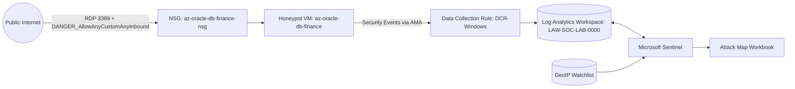
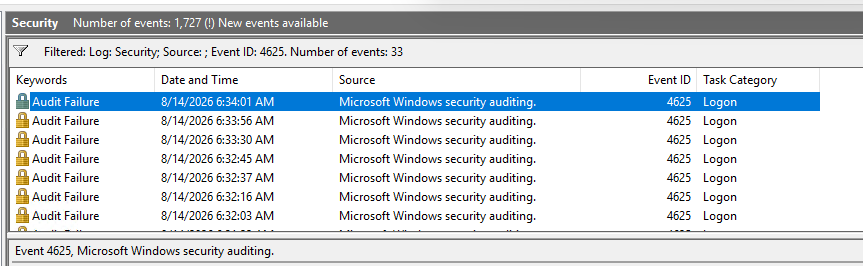

# Cloud Honeypot: Live Attacker Telemetry with Microsoft Sentinel
### An Intentionally Exposed Azure VM, Weaponized as a Real-World SOC Data Source


A cloud home lab that deploys a deliberately exposed Windows VM in Azure, then builds a full detection pipeline — Log Analytics, Microsoft Sentinel, GeoIP enrichment, and a live attack map — to observe and analyze real brute-force activity from the public internet.

Every data point in this lab is a genuine, unsolicited attack. Nothing here is simulated traffic — the goal was to see, with real numbers, exactly how fast an exposed asset gets found and how far a lightweight Sentinel pipeline can take that raw telemetry.

---

## Table of Contents

- [Project Overview](#project-overview)
- [Architecture](#architecture)
- [Implementation](#implementation)
- [Key Takeaways](#key-takeaways)
- [What's Next](#whats-next)

---

## Project Overview

### Objective

Stand up a minimal, intentionally vulnerable cloud asset, then build the logging and SIEM pipeline needed to capture, enrich, and visualize real-world attacker activity against it — end to end, from a blank subscription to a live geographic attack map.

### Key Components

- **Azure VM** – The honeypot: a Windows 11 host with no host firewall and a wide-open NSG
- **Log Analytics Workspace** – Central log repository
- **Microsoft Sentinel** – SIEM, KQL hunting, and watchlist-based enrichment
- **Sentinel Workbook** – Heatmap visualization of attacker geolocation

### Tech Stack

| Component | Technology |
|-----------|-----------|
| Cloud platform | Microsoft Azure (pay-as-you-go) |
| SIEM | Microsoft Sentinel |
| Log repository | Azure Log Analytics Workspace |
| Log shipping | Azure Monitor Agent (AMA) + Data Collection Rule |
| Query language | KQL (Kusto Query Language) |
| Enrichment | Sentinel Watchlist (GeoIP CSV, `ipv4_lookup`) |
| Visualization | Sentinel Workbook (heatmap) |
| Target OS | Windows 11 Pro, version 25H2 (x64, Gen2) |

---

## Architecture



**Data Flow:**
1. Public internet traffic hits the VM's RDP port, unrestricted by NSG or host firewall
2. Windows Security events (including failed logons) are generated locally on the VM
3. Azure Monitor Agent forwards Security events to the Log Analytics Workspace via a Data Collection Rule
4. Microsoft Sentinel queries the workspace, enriches attacker IPs against a GeoIP watchlist, and plots results on a live Workbook map

**Resource Group:** `RG-Home-Lab` · **Virtual Network:** `Vnet-Home-Lab` (10.0.0.0/24) · **Region:** East Asia (Hong Kong)

---

## Implementation

### Phase 1 — Build the Range

Created the resource group (`RG-Home-Lab`), virtual network (`Vnet-Home-Lab`, 10.0.0.0/24), and the honeypot VM itself:

| Setting | Value |
|---|---|
| VM Name | `az-oracle-db-finance` *(deliberately named to look like production, not "honeypot")* |
| Image | Windows 11 Pro, 25H2, x64 Gen2 |
| Size | Standard_D2as_v6 (2 vCPU / 8 GB RAM) |
| OS disk | Standard SSD (LRS) |
| Boot diagnostics | Disabled |

#### Problem: VM size unavailable in the target region

Initial deployment to Southeast Asia failed with `NotAvailableForSubscription` — the Standard_D2as_v6 size wasn't available for this subscription tier in that region.


Since a resource group's region can't be changed after creation, the fix meant tearing down and rebuilding — not patching a setting. Upgraded to pay-as-you-go and redeployed the entire resource group in **East Asia (Hong Kong)**, the lowest-latency alternative for APAC capacity.


---

### Phase 2 — Expose the Honeypot (Hardening, in Reverse)

On the VM's NSG (`az-oracle-db-finance-nsg`), deleted the default RDP-only inbound rule and replaced it with a single rule allowing all sources, ports, and protocols:

| Field | Value |
|---|---|
| Source / Destination | Any / Any |
| Port range | * |
| Protocol | Any |
| Priority | 100 |
| Name | `DANGER_AllowAnyCustomAnyInbound` |


The `DANGER_` prefix is intentional — it flags the severity of the rule to anyone reviewing the NSG later. RDP'd into the VM and disabled the Windows Defender Firewall across all three profiles (Domain / Private / Public) via `wf.msc`.

#### Problem: VM unreachable despite a fully open NSG

Pinging the VM's public IP to confirm reachability — the same test any scanner or bot would perform — returned nothing, even with the NSG wide open.


The NSG and the guest OS firewall are independent control planes; Windows blocks inbound ICMP by default regardless of NSG state. Fixed with an explicit inbound allow rule via PowerShell:

```powershell
New-NetFirewallRule -DisplayName "Allow ICMPv4-In" -Protocol ICMPv4 -IcmpType 8 -Action Allow
```


Bidirectional ping confirmed across all hosts after the rule was applied.

---

### Phase 3 — Local Log Validation

Before wiring up any pipeline, confirmed the VM was logging authentication failures locally. Intentionally failed a login with a bogus account, then checked **Windows Logs → Security**, filtered to **Event ID 4625** (An account failed to log on).



---

### Phase 4 — Centralizing Logs: Log Analytics & Sentinel

Built the forwarding pipeline:

1. **Log Analytics Workspace** — `LAW-SOC-LAB-0000`, the central log repository
2. **Microsoft Sentinel** — provisioned and linked to the workspace
3. **Windows Security Events connector** — installed via **Content Management → Content Hub**, then configured for delivery via Azure Monitor Agent
4. **Data Collection Rule** — `DCR-Windows`, scoped to the honeypot VM, collecting all Security events

Confirmed ingestion directly in Log Analytics using KQL mode:

```kql
SecurityEvent
```


---

### Phase 5 — Threat Hunting with KQL

With logs flowing, queried for authentication failures against the honeypot:

```kql
SecurityEvent
| where EventID == 4625
| project TimeGenerated, Account, Computer, EventID, Activity, IpAddress
```


A manual lookup of one attacker IP (`163.223.18.58`) confirmed a real, unsolicited login attempt originating from Afghanistan — the honeypot was already being actively probed.


---

### Phase 6 — GeoIP Enrichment

Raw IP addresses aren't map-ready on their own, so a GeoIP CSV was uploaded into Sentinel as a **watchlist** (`geoip`), keyed on `network`:

```kql
let GeoIPDB_FULL = _GetWatchlist("geoip");
let WindowsEvents = SecurityEvent
| where EventID == 4625
| order by TimeGenerated desc
| evaluate ipv4_lookup(GeoIPDB_FULL, IpAddress, network);
WindowsEvents
```


This joins every failed-logon event to a city, country, and lat/long — enrichment done entirely inside Sentinel, no external API calls at query time.

---

### Phase 7 — Attack Map Visualization

Built a Sentinel Workbook backed by a summarized, heatmap-visualized query, counting failed logons per unique IP/location and rendering them as a green-to-red heatmap sized by failure count:

```kql
let GeoIPDB_FULL = _GetWatchlist("geoip");
let WindowsEvents = SecurityEvent;
WindowsEvents
| where EventID == 4625
| order by TimeGenerated desc
| evaluate ipv4_lookup(GeoIPDB_FULL, IpAddress, network)
| summarize FailureCount = count() by IpAddress, latitude, longitude, cityname, countryname
| project FailureCount, AttackerIp = IpAddress, latitude, longitude,
          city = cityname, country = countryname,
          friendly_location = strcat(cityname, " (", countryname, ")")
```

**20 minutes after going public:**


| Location | Failed logons |
|---|---|
| Santa Fe, United States | 108 |
| Hyderabad, India | 88 |
| Binesvagen, Norway | 38 |

**12 hours after going public:**


| Location | Failed logons |
|---|---|
| Maam, Netherlands | 35.1K |
| Skien, Norway | 19.1K |
| Gangbuk-gu, South Korea | 11.4K |
| Auckland, New Zealand | 11.3K |
| Sydney, Australia | 8.81K |
| Makati City, Philippines | 4.42K |
| Hyderabad, India | 4.36K |
| Santa Fe, United States | 3.23K |
| Split, Croatia | 3.11K |

---

## Key Takeaways

- **Exposure time-to-attack is measured in minutes, not days.** A single open RDP port with no host firewall was probed within 20 minutes and had five-figure failed-logon volume from a single country within 12 hours.
- **NSG rules and the guest OS firewall are independent control planes.** A fully open NSG doesn't guarantee reachability — the host firewall can silently drop traffic the network layer already allowed, and each has to be verified on its own.
- **Region/SKU availability is a real deployment constraint.** Since a resource group's region is immutable post-creation, confirming SKU availability before the first deploy avoids a full teardown-and-rebuild cycle.
- **Watchlist-based enrichment is a lightweight alternative to external GeoIP APIs.** `_GetWatchlist` + `ipv4_lookup` resolves IP-to-location entirely inside Sentinel, at query time, with no outbound dependency.

---

## What's Next

- [ ] Convert the manual KQL hunt into a scheduled Sentinel Analytics Rule with automated alerting
- [ ] Add a Fusion SOAR playbook to auto-tag or block repeat-offender IPs
- [ ] Cross-reference top attacker IPs against threat intel feeds (AbuseIPDB, GreyNoise)
- [ ] Extend the watchlist enrichment pattern to RDP brute-force attempts against a Linux SSH honeypot for comparison
- [ ] Map observed activity to MITRE ATT&CK (Initial Access — T1110 Brute Force) and build a coverage summary

---

## License

MIT License - See [LICENSE](/License) file for details

---

## Contact

**John William Estacio**

- **LinkedIn:** https://www.linkedin.com/in/johnwilliamestacio/
- **GitHub:** https://github.com/johnwilliamestacio

Questions, feedback, or want to discuss SOC automation, detection engineering, or Sentinel? Feel free to connect.

---

## Acknowledgments

**Tech Stack Credits:**
- [Microsoft Azure](https://azure.microsoft.com/)
- [Microsoft Sentinel](https://azure.microsoft.com/en-us/products/microsoft-sentinel)
- [Kusto Query Language (KQL)](https://learn.microsoft.com/en-us/kusto/query/)

---

*"You don't need a simulated range to learn what attackers actually do — sometimes the most honest telemetry comes from just opening the door and watching who walks in."*
